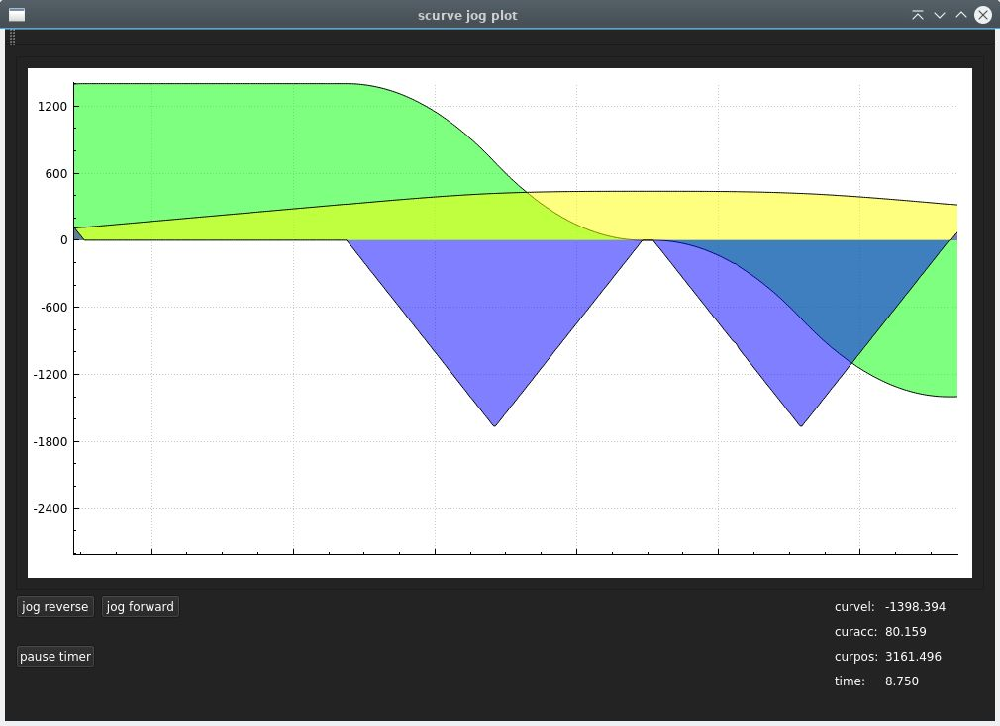
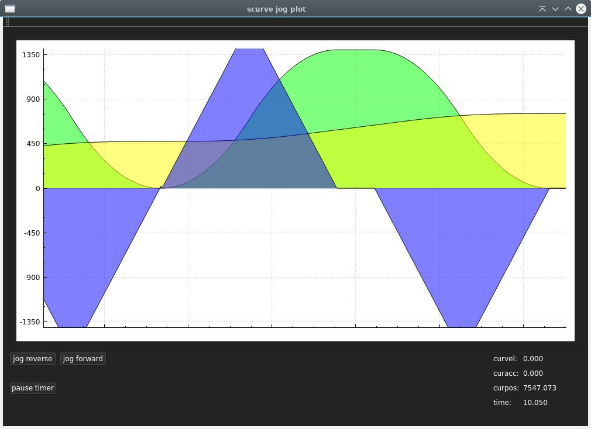
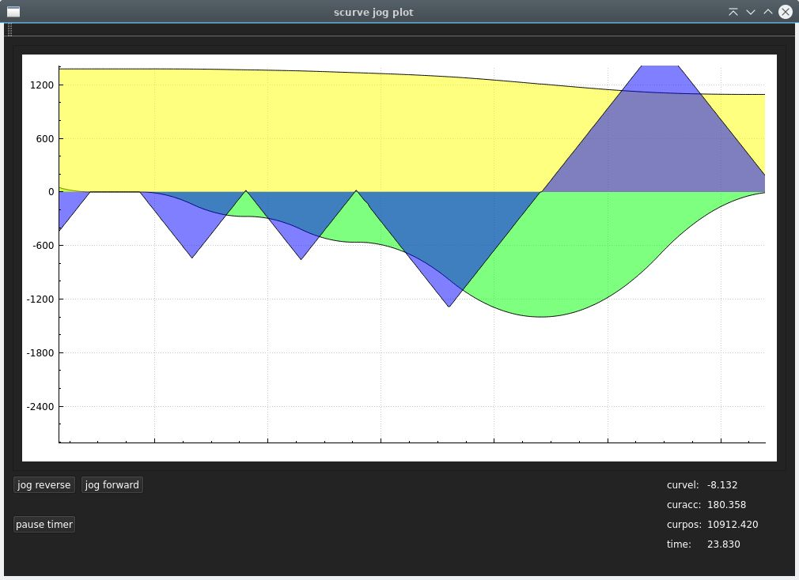
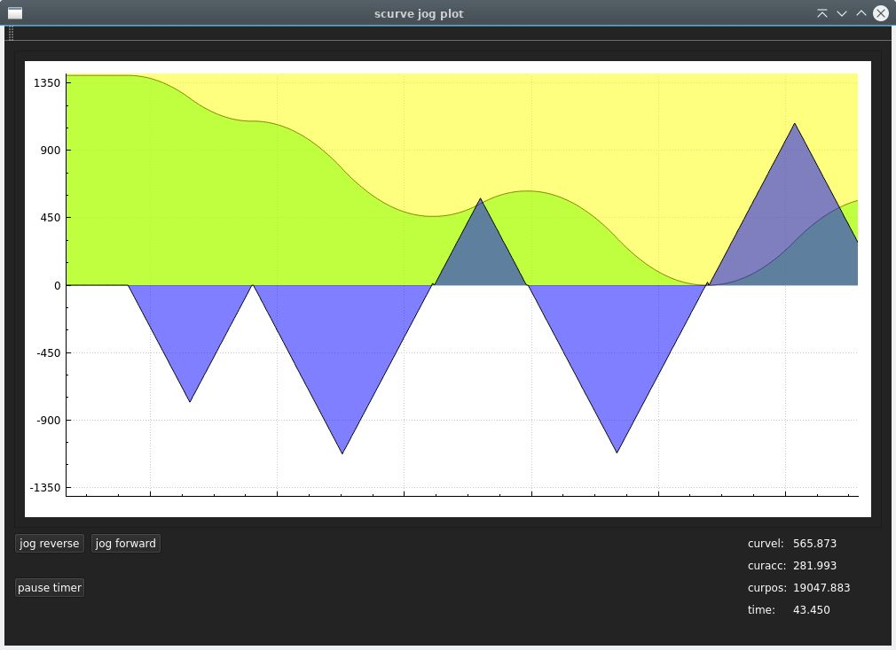

### scurve_motion Library

### Overview

The `scurve_motion` library is a C++ library designed for jogging applications with S-curve motion profiles. It enables smooth acceleration and deceleration for precise and controlled jogging motion.

### Features

- S-curve motion profiling for smooth jogging.
- Jerk limited.
- Support for both forward and reverse jogging.
- Linear acceleration stage between concave & convex curve depending on jerk value.
- Gui project to preview curve outputs in a qt-realtime-plot.
- During button press & release interupts, the curve will go to zero acceleration first. From there a new trajectory is calculated.

### Language

- Written for c & c++ projects.

### Example for c

```
#include "scurve_motion.h"

int main(int argc, char *argv[]) {
    struct scurve_status s;

    s.maxacc = 10;
    s.jerk_max = 10;
    s.maxvel = 25;
    s.cycletime = 0.01;

    button_forward_cycle(&s); // Simulate a button press.

    while (s.vr < s.maxvel) { // Run up to velocity max.
        update_cycle(&s);
        printf("v: %f \n", s.vr);
    }

    button_release_cycle(&s); // Simulate a button release.

    while (s.vr > 0) { // Run down to zero velocity.
        update_cycle(&s);
        printf("v: %f \n", s.vr);
    }

    return 0;
}
```

### Prerequisites

- CMake (version 3.5 or higher)
- C++ compiler

### Building

```bash
mkdir build
cd build
cmake ..
make
```

### Pictures "qt plot"







